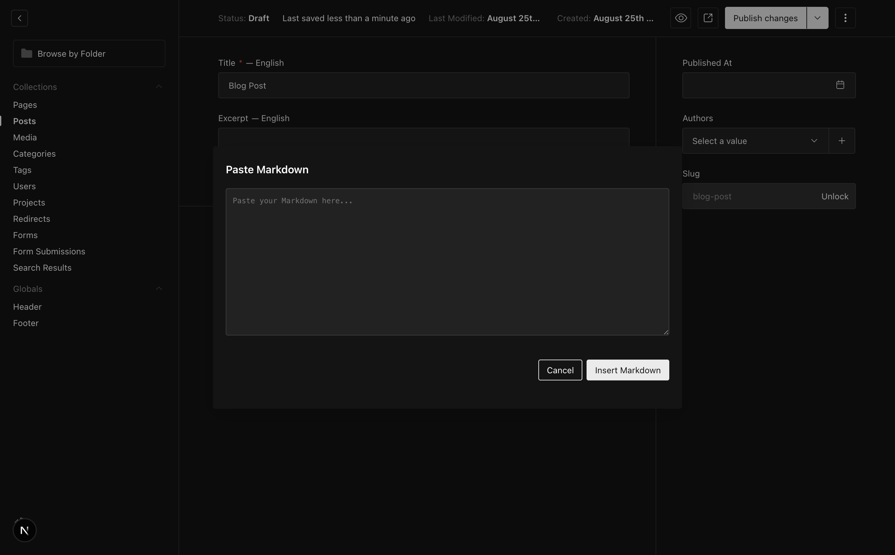

# payload-paste-as-markdown



A reusable Payload CMS 3.x Lexical editor feature that lets authors paste raw Markdown into the rich-text editor via a toolbar button, slash command, or keyboard-free drawer.

## Compatibility

- **Payload CMS:** 3.x only. This package is not compatible with Payload 2.x.
- **React:** 19.x (via peer dependencies).

> If you're browsing this repository on GitHub, please tag it with the [`payload-plugin`](https://github.com/topics/payload-plugin) topic so it surfaces in Payload community plugin listings.

This is a **Lexical editor feature** rather than a top-level `buildConfig` plugin, so it is configured inside `lexicalEditor({ features: [...] })`.

## Features

- Toolbar button in both fixed and inline toolbars
- Slash-menu item (`/markdown`, `/md`, `/paste`)
- Modal drawer with a monospace textarea for raw Markdown input
- Inserts converted Markdown at the exact cursor position, splitting the current paragraph when needed
- Zero backend code — it is a pure client Lexical feature

## Installation

```bash
npm install payload-paste-as-markdown
# or
pnpm add payload-paste-as-markdown
# or
yarn add payload-paste-as-markdown
```

This package expects `payload`, `@payloadcms/richtext-lexical`, `@payloadcms/ui`, `react`, and `react-dom` to already be installed in your project.

## Usage

Import the server feature and add it to the `features` array of any `lexicalEditor`:

```ts
import { MarkdownPasteFeature } from 'payload-paste-as-markdown'
import { lexicalEditor } from '@payloadcms/richtext-lexical'
import type { CollectionConfig } from 'payload'

export const Posts: CollectionConfig = {
  slug: 'posts',
  fields: [
    {
      name: 'content',
      type: 'richText',
      editor: lexicalEditor({
        features: ({ defaultFeatures }) => [
          ...defaultFeatures,
          MarkdownPasteFeature(),
        ],
      }),
    },
  ],
}
```

After installing, regenerate Payload's import map:

```bash
npx payload generate:importmap
```

## How it works

1. The server feature registers a client feature string that Payload resolves through the import map.
2. The client feature adds a toolbar button, slash-menu group, and a plugin.
3. The plugin opens a React-portal drawer when the command is dispatched.
4. When the author confirms, the raw Markdown is converted using Lexical's markdown transformers and inserted at the original cursor position.

## Peer dependencies

- `payload` ^3.0.0
- `@payloadcms/richtext-lexical` ^3.0.0
- `@payloadcms/ui` ^3.0.0
- `react` ^19.0.0
- `react-dom` ^19.0.0

## License

MIT
Sponsored by: [Onion Creative](https://www.onioncreative.com)
